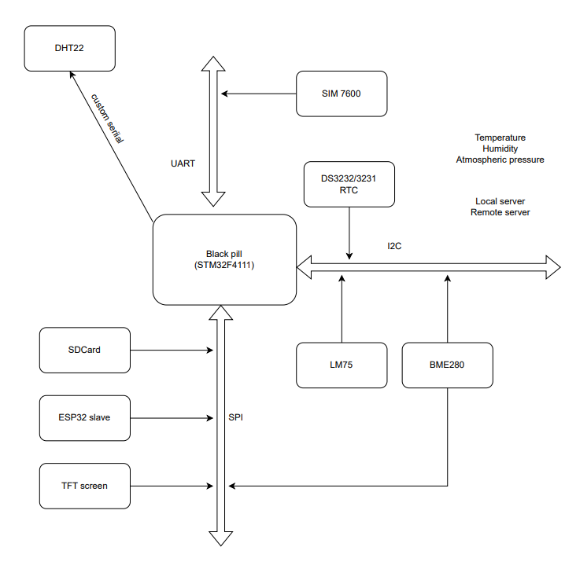

Above is the block diagram for the project 

# Setting Up 

This guide is for windows users

## STM32CubeMx Download

Visit this [link](https://www.st.com/en/development-tools/stm32cubemx.html) to download 

## Add extension for Vscode

### Add C/C++ microsft extension for vscode

### Add STM32 extension for vscode

## Install All build-tools from extension

From vscode press `Ctrl+ Shift + P` and start typing stm32, this will show some options as below:

Select the `install all build tools for STM32 for vs-code extension`. this should install all build tools

## Building

From vscode press `Ctrl+ Shift + P` and start typing stm32, this show options as below:

Select the ` build STM32 project ` option. This should build the project.

## Flashing

From vscode press `Ctrl+ Shift + P` and start typing `flash`, this show options as below:

Select the ` build and flash to an STM32 platform ` option. This should build the project.

## Debugging

click run and debug option at the left options on vscode, then click the little play buttton beside the `Debug STM32` option to
start debugging

## Making changes to Peripherals

- right click on the file at `smart_weather_station\smart_weather_station.ioc`
- click on `Reveal in File explorer `, the file manager should open
- double click on the same file ending in ioc, it should open in CubeMX if you have it installed, the you can make the
 the necessary chamges from GUI. Alternatively, you can make the chnages from code.

## Using printf

- printf is now routed to USART1 on PIN A9 and A10
- See below diagram for connection guide

- To turnoff printf entirely goto file `STM32-for-VSCode.config.yaml`  and remove `- -DDEBUG` under cFlags

## Build with docker

- Run `bash generate_docker.sh` , this will build the docker image
- Run `bash build.sh clean` , this will clean the build directory by removing the binaries
- Run `bash build.sh debug` , this will build the project using the Makefile within the project directory

### Debugging with the image generated from Docker

-click run and debug option at the left options on vscode, then click the little play buttton beside the `Vanilla Debug STM32` option to start debugging, if you don't see the `Vanilla Debug STM` you may have to click the drop by the selection to select it
from the option.

# Datasheets

- AM2302 (DHT22) datasheet [link](https://cdn-shop.adafruit.com/datasheets/Digital+humidity+and+temperature+sensor+AM2302.pdf)

