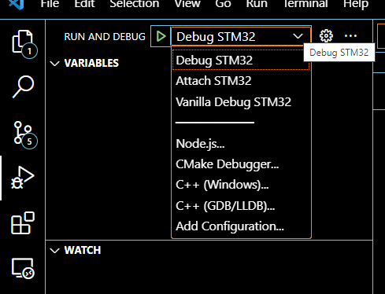

# Project Smart Weather Station Overview.
This Project is about a smart weather station using an STM-based MCU and other peripherals such as a the RTC for timing, DHT22 For temperature and humidity,BME280  for pressure, temperature and humidity,LM75 for temperature sensing.

The Goal of the project a all-in one digital smart weather station to meausre parameters such as temperature, humidity and pressure and store them over time.

Solving this problem will include writing the necessary codes that enables these hardware peripherals work together in sync, and also assembling all componets in a compact form with a screen to display all te weather parameters and also store data gotten overtime.

.png>)

Above is the block diagram for the project 

# How to contribute to project

- git clone --recursive `<repo-url>`
- git checkout main
- git pull
- git checkout -b ticket-`<name-of-task>`
- git push -u origin ticket-`<name-of-task>`
- continue to work on local branch
- when done do "git push" to push your code to the repo
- create pull request to allow your work to be merged to main branch

# updating submodules

- git submodule init
- git submodule update --recursive

# Setting Up 

This guide is for windows users

## STM32CubeMx Download

Visit this [link](https://www.st.com/en/development-tools/stm32cubemx.html) to download 

## Add extension for Vscode

### Add C/C++ microsft extension for vscode

### Add STM32 extension for vscode

## Install All build-tools from extension

From vscode press `Ctrl+ Shift + P` and start typing stm32, this will show some options as below:

Select the `install all build tools for STM32 for vs-code extension`. this should install all build tools

## Building

From vscode press `Ctrl+ Shift + P` and start typing stm32, this show options as below:

Select the ` build STM32 project ` option. This should build the project.

## Flashing

From vscode press `Ctrl+ Shift + P` and start typing `flash`, this show options as below:

Select the ` build and flash to an STM32 platform ` option. This should build the project.

## Debugging

click run and debug option at the left options on vscode, then click the little play buttton beside the `Debug STM32` option to
start debugging

## Making changes to Peripherals

- right click on the file at `smart_weather_station\smart_weather_station.ioc`
- click on `Reveal in File explorer `, the file manager should open
- double click on the same file ending in ioc, it should open in CubeMX if you have it installed, the you can make the
 the necessary chamges from GUI. Alternatively, you can make the chnages from code.

## Using printf

- printf is now routed to USART1 on PIN A9 and A10
- See below diagram for connection guide

- To turnoff printf entirely goto file `STM32-for-VSCode.config.yaml`  and remove `- -DDEBUG` under cFlags

## Build with docker
Before starting to build with docker, first launch the docker desktop software, then follow the process below
- Run `bash generate_docker.sh` , this will build the docker image
- Run `bash build.sh clean` , this will clean the build directory by removing the binaries
- Run `bash build.sh debug` , this will build the project using the Makefile within the project directory

NOTE: If you run the second and third command above and its giving error as below (most especially if you are using windows 10),
first run `dos2unix build.sh` before rerunning the commands.

### Debugging with the image generated from Docker

-click run and debug option at the left options on vscode, then click the little play buttton beside the `Vanilla Debug STM32` option to start debugging, if you don't see the `Vanilla Debug STM` you may have to click the drop by the selection to select it
from the option.

# Generating documnetation

- install doxygen at [link](https://www.doxygen.nl/download.html)

- Add the following vscode extensions

- press `Ctrl+Shift+P` ,then start typing `doxygen` select option `Generate documentation` in the list

- this should generate the docs which can be found at `Docs/output`

## adding more docs

- Add your doxygen compatible comments such as shown below:

to your header file

- add the path to the parent directory of your header file in the Doxyfile at point shown below:

- then regenerate docs as shown in the `Generating documnetation` above

# ESP32 Code

- goto [link](https://github.com/botsgeek/esp32_at) for guide on flashing AT firmware on the esp32

# Datasheets

- AM2302 (DHT22) datasheet [link](https://cdn-shop.adafruit.com/datasheets/Digital+humidity+and+temperature+sensor+AM2302.pdf)

